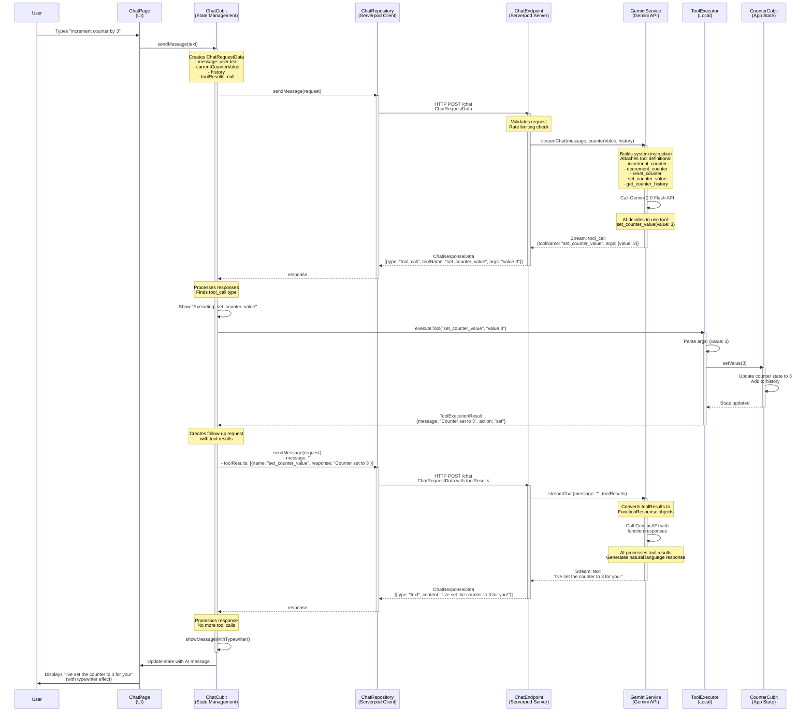

# Tool Call Flow Diagram

## Complete Tool Call Architecture



## Project Structure

```
app_use/
│
├── lib/                                    # 📱 Flutter App (Client)
│   ├── main.dart                          # App entry point
│   ├── app.dart                           # Root app widget
│   │
│   ├── chat/                              # 💬 Chat Feature
│   │   ├── cubit/
│   │   │   ├── chat_cubit.dart           # Orchestrates chat flow
│   │   │   └── chat_state.dart           # Chat state definition
│   │   │
│   │   ├── repositories/
│   │   │   ├── chat_repository.dart      # Abstract repository
│   │   │   └── chat_repository_impl.dart # Serverpod client wrapper
│   │   │
│   │   ├── services/
│   │   │   ├── tool_executor.dart        # Tool executor interface
│   │   │   └── counter_tool_executor.dart # Counter tool implementation
│   │   │
│   │   ├── models/
│   │   │   ├── chat_message_model.dart   # Message models
│   │   │   └── tool_execution_result.dart # Tool result wrapper
│   │   │
│   │   ├── view/
│   │   │   └── chat_page.dart            # Main chat UI
│   │   │
│   │   └── widgets/
│   │       ├── chat_input.dart           # Message input widget
│   │       ├── chat_message_list.dart    # Message list widget
│   │       └── tool_execution_indicator.dart # Tool execution UI
│   │
│   └── counter/                           # 🔢 Counter Feature
│       ├── cubit/
│       │   ├── counter_cubit.dart        # Counter state management
│       │   └── counter_state.dart        # Counter state definition
│       ├── models/
│       │   └── counter_operation.dart    # Operation history model
│       └── view/
│           └── counter_page.dart         # Counter UI
│
├── app_use_server/                        # 🖥️ Backend (Serverpod)
│   │
│   ├── app_use_server_client/            # 📦 Generated Client SDK
│   │   └── lib/
│   │       ├── app_use_server_client.dart
│   │       └── src/
│   │           ├── protocol/             # Generated protocol classes
│   │           │   ├── chat_request_data.dart
│   │           │   ├── chat_response_data.dart
│   │           │   ├── chat_response_item.dart
│   │           │   ├── tool_result_item.dart
│   │           │   └── chat_history_item.dart
│   │           └── client.dart           # Generated client
│   │
│   └── app_use_server_server/            # 🎯 Server Implementation
│       ├── bin/
│       │   └── main.dart                 # Server entry point
│       │
│       └── lib/
│           ├── server.dart               # Server configuration
│           │
│           └── src/
│               ├── endpoints/
│               │   └── chat_endpoint.dart # HTTP endpoint for chat
│               │
│               ├── services/
│               │   └── gemini_service.dart # Gemini API integration
│               │
│               └── generated/
│                   └── protocol/         # Protocol definitions
│                       ├── chat_request_data.dart
│                       ├── chat_response_data.dart
│                       └── ... (other protocol files)
│
└── pubspec.yaml                           # Flutter dependencies
```

## Key Components

### 1. **Flutter App Layer** (`lib/`)
- **ChatPage** (`lib/chat/view/chat_page.dart`): UI that displays messages and input
- **ChatCubit** (`lib/chat/cubit/chat_cubit.dart`): State management, orchestrates the entire flow
- **CounterToolExecutor** (`lib/chat/services/counter_tool_executor.dart`): Executes tools locally in the app
- **CounterCubit** (`lib/counter/cubit/counter_cubit.dart`): Manages counter state and history

### 2. **Network Layer** (`lib/chat/repositories/`)
- **ChatRepository** (`chat_repository.dart`): Abstract interface for chat operations
- **ChatRepositoryImpl** (`chat_repository_impl.dart`): Serverpod client wrapper for HTTP communication
- Uses generated Serverpod Client for type-safe communication

### 3. **Server Layer** (`app_use_server/app_use_server_server/`)
- **ChatEndpoint** (`lib/src/endpoints/chat_endpoint.dart`): Handles incoming HTTP requests, rate limiting, validation
- **GeminiService** (`lib/src/services/gemini_service.dart`): Interfaces with Gemini API, defines tool schemas

### 4. **Generated Client SDK** (`app_use_server/app_use_server_client/`)
- Automatically generated by Serverpod
- Provides type-safe models: `ChatRequestData`, `ChatResponseData`, `ToolResultItem`, etc.
- Ensures client and server use identical data structures

### 5. **AI Layer** (External)
- **Gemini 2.0 Flash API**: Processes natural language, decides which tools to call
- Receives tool definitions and current context
- Returns text responses and/or tool call instructions

## Data Flow Summary

### Request Flow (App → Server → AI)
```
User Input 
  → ChatCubit (adds context: counter value, history)
  → ChatRepository (Serverpod client)
  → ChatEndpoint (validates, rate limits)
  → GeminiService (adds tool definitions, system instruction)
  → Gemini API (processes with tools)
```

### Response Flow (AI → Server → App)
```
Gemini API Response (text + tool_calls)
  → GeminiService (streams responses)
  → ChatEndpoint (converts to ChatResponseData)
  → ChatRepository (returns to app)
  → ChatCubit (processes responses)
  → If tool_call: Execute locally → Send results back (loop)
  → If text: Display to user
```

## Tool Call Loop

The system supports **multi-turn tool calling**:

1. **Turn 1**: User sends message → AI responds with tool call
2. **Tool Execution**: App executes tool locally, gets result
3. **Turn 2**: App sends tool results back → AI processes results → AI responds with text or more tool calls
4. **Repeat**: Loop continues until AI provides final text response (no more tool calls)

This enables complex interactions like:
- "Increment 3 times then show history" (4 tool calls in sequence)
- "Set to 10 and tell me the current value" (2 tool calls)

## Key Features

### Local Tool Execution
- Tools run **in the Flutter app**, not on server
- Direct access to app state (CounterCubit)
- Instant feedback to user

### Type-Safe Communication
- Serverpod provides generated client/server types
- ChatRequestData, ChatResponseData, ToolResultItem
- Compile-time safety across network boundary

### Streaming Responses
- Server streams AI responses in real-time
- Supports typewriter effect in UI
- Tool calls streamed as separate chunks

### State Synchronization
- Current counter value sent with each request
- AI always has latest app state
- Tool results include state changes

## Tool Definitions (in GeminiService)

```dart
- increment_counter: Increases counter by 1
- decrement_counter: Decreases counter by 1
- reset_counter: Resets counter to 0
- set_counter_value(value: int): Sets counter to specific value
- get_counter_history: Retrieves operation history
```

These tools are defined in `GeminiService._getCounterTools()` and sent to Gemini API with each request.
